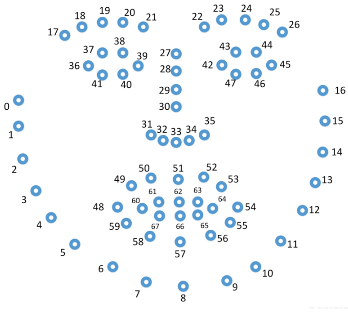

# LandmarksAnnotation
Manual annotation face 68 landmarks coordinate and output label txt file

# How to use

1. pip install -r requirements.txt

2. Copy need to label face image files to a dir.

3. Modify annotation.py "input_image_root_path" to the image dir path.

4. **Run "annotation.py" and manual label**

5. Label files will be save with 'image file name without ext' + ".pts" path.

# Label sample

# Customize

You can make your own annotation by changing annotation.py
