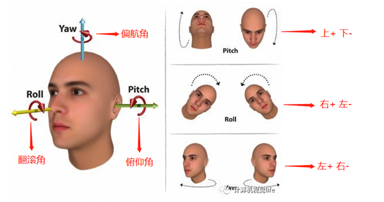

# PoseAnnotation
Manual annotation face 3 pose angle and output label txt file

# How to use

1. pip install -r requirements.txt

2. Copy need to label face image files to a dir.

3. Modify annotation.py "wait_mark_image_root_path" and "output_label_txt_path" to the image dir path and label txt path.

4. **Run "annotation.py"**

5. Label file will be save to "output_label_txt_path" path.

# Label sample

# Customize

You can make your own annotation by changing annotation.py
